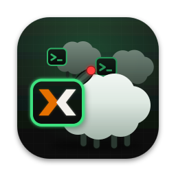

# VMherd

[](https://github.com/WietseWind/VMherd/actions/workflows/ci.yml)
[](https://github.com/WietseWind/VMherd/actions/workflows/supply-chain.yml)

By The Integrators BV (NL), Wietse Wind · <https://vmherd.app> · <https://github.com/WietseWind/VMherd>

Many Proxmox VM consoles in one window, and one keyboard for all of them.

Pick VMs from a cluster, watch their consoles live in a grid (like the Proxmox noVNC console), power them on / off one by one, and type once into every console at the same time — installers, first logins, anything before SSH works. Native app (Rust + egui) for macOS, Linux and Windows.



## Use

```
vmherd                              # cluster list
vmherd --cluster Lab 101 102     # connect and open these VMs
```

| Part | What it does |
|---|---|
| **Clusters** (home screen) | Bookmarks: name, API URL (`https://host:8006`; plain `http` only for `localhost`), API token ID (`user@realm!name`) and where the token secret comes from (see [Token secrets](#token-secrets)). On first connect the server certificate is shown and pinned (trust on first use, like SSH); a changed certificate is refused until you accept it again. |
| **VMs** (top left) | Picker: filter by name / VMID / node / tag (`space` = and, `,` = or; a pasted column of VMIDs matches exactly those), sortable columns, click to add/remove, shift-click for a range. Tiles appear in pick order. The grid is remembered per cluster. |
| **Tile** | VMID, name, node, status lamp + uptime, live console. `▶` start, `⏻` shutdown (ACPI), `■` hard stop (both need a second click within 3 s), `⟳` reconnect, `⤢` maximize (Esc restores), `✕` remove. The console connects by itself while the VM runs (so the boot is visible) and reconnects after drops. |
| **Sync toggle** (red, per tile) | Whether the tile receives broadcast input; `sync all / none` in the bar. |
| **Broadcast box** | Click it → **ON AIR**: every key goes to all synced, connected consoles as physical keys (QEMU extended key events: the guest's keyboard layout applies, like a real keyboard). ⌘ shortcuts stay local on macOS; ⌘V / Ctrl+V types the clipboard (asks first when it has several lines). Buttons for ↵ Tab Esc ↑ ↓ ^C ^D ^Z ^L. Click anywhere else to stop; held keys are released. |
| **Click a console** | **SOLO** (amber): keys go to that VM only, mouse too. |
| **Keyboard** | `Enter` (nothing focused): type into all synced consoles. Hold `Esc` 1 s: leave broadcast / solo (a short `Esc` goes to the consoles). `/` (nothing focused): show / hide the VM list; in it `Tab` / arrows move, `Space` adds or removes the VM, `Esc` closes. |
| **Type text** | Types the text box into all synced consoles, with per-VM placeholders: `{{vmid}}`, `{{name}}`, `{{node}}`, and `{{ipv4}}` / `{{ipv6}}` (the guest's first global address, from the QEMU guest agent or the container's interfaces; if a VM has no address, nothing is typed). E.g. `echo {{name}} {{ipv4}}`. `+ ↵` presses Enter after; ⌘↵ / Ctrl+↵ in the box types. |

Notes:

- Typed text is sent as US-keyboard scancodes one character at a time (default 20 ms): QEMU's PS/2 queue holds only a few keys. Raise the delay if characters get lost; the guest needs the US layout for typed text.
- Consoles open in *shared* mode, so an open Proxmox web console stays connected. Each connection is a `vncproxy` task (with a one-time `generate-password`) in the Proxmox task log.
- The API token needs `VM.Audit`, `VM.Console` and (for the power buttons) `VM.PowerMgmt` on `/vms`.
- Keys are released on every focus change, when the window hides and when a paste starts, and a key-up always goes to the consoles that got the key-down, so no modifier stays stuck in a guest.
- Console access to a guest with tty autologin + passwordless sudo is root access.

## Token secrets

| Option | macOS | Windows | Linux |
|---|---|---|---|
| **Save it in the …** | Keychain | Windows Credential Manager | Secret Service keyring (GNOME Keyring, KWallet, KeePassXC). Greyed out when no keyring daemon runs, e.g. on a minimal or headless system. |
| **Use an existing Keychain item** | by service name (read with `security`) | – | – |
| **Get it from a command** | ✓ | ✓ | ✓ The first line the command prints is the secret: `pass show pve/token`, `secret-tool lookup service pve`, `op read op://vault/pve/token`, `bw get password pve`, … |
| **Save it in a private file** | – | – | A file only your user can read (mode 600, folder 700) in the config directory. Not encrypted: for systems without a keyring. |

Secrets never go into `config.json`. Deleting a bookmark, or moving its secret elsewhere, removes what VMherd saved.

## Build

Needs Rust (stable, see `rust-toolchain.toml`).

```
cargo run --release -p vmherd
cargo test --workspace
cargo clippy --workspace --all-targets -- -D warnings
```

- **macOS app**: `tools/bundle-macos.sh` → `dist/VMherd.app` (universal binary, ad-hoc signed; `--native` for this Mac only). To hand it to others, sign with a Developer ID and notarize.
- **Linux**: needs the usual winit/wgpu deps (`libxkbcommon`, Wayland or X11, Vulkan or GL drivers). `packaging/linux/vmherd.desktop` + `assets/icon/vmherd-256.png` for menus. `tools/test-linux.sh` builds and tests it in Docker, with and without a Secret Service.
- **Windows**: `cargo build --release -p vmherd`; the icon is embedded by `build.rs`.
- **Cryptography**: on macOS VMherd uses only the operating system's: TLS through the system TLS stack and trust
  store (Security.framework / Secure Transport, TLS 1.2), and the VNC password DES through Security.framework, so no
  third-party encryption code ships in the app (App Store export compliance: "only uses encryption within Apple's
  operating system"). Linux and Windows use rustls (aws-lc-rs) with the platform verifier and the `des` crate. The
  certificate check (pin or system trust) finishes before any request or token is sent, on every platform.
  `tools/check-macos-crypto.sh` fails if a third-party crypto crate enters the macOS dependency graph.
- Licenses: `tools/licenses.sh` regenerates `THIRD-PARTY-LICENSES.md` (all crates for all platforms + the bundled fonts, via `cargo-about`); ship it with every build (the macOS bundle includes it). Run it after dependency updates.
- Icons: edit `assets/icon/vmherd-prompt.svg` (+ `vmherd-prompt-small.svg` for 16–64 px), then `tools/make-icons.sh`. `VARIANT=proxmox` renders the private variant with a Proxmox-style X on the lead screen (`vmherd.svg`); the Proxmox logo is a trademark of Proxmox Server Solutions GmbH, so releases use the neutral `>_` set.

## CI and supply chain

- **CI** (`.github/workflows/ci.yml`): format, clippy and tests on macOS, Windows and Linux (Linux also runs the
  Secret Service tests, the end-to-end typing test against the mock and `tools/check-macos-crypto.sh`), then release builds: universal
  `VMherd.app` (zip), Windows `vmherd.exe`, Linux binary (tar.gz), each with the license files, as run artifacts.
- **Supply chain** (`.github/workflows/supply-chain.yml`, also daily): `cargo-deny` with `deny.toml` checks RustSec
  advisories (vulnerable, unsound, yanked crates), that every crate comes from crates.io (no git or unknown
  registries), licenses and banned patterns; builds use the committed `Cargo.lock` (`--locked`). Dependabot
  (`.github/dependabot.yml`) proposes crate and GitHub Actions updates; third-party actions are pinned to commit SHAs.
- Locally: `cargo deny check`, `tools/check-macos-crypto.sh`, `tools/test-linux.sh`, `actionlint` / `zizmor .github/workflows`.

## Layout

| Path | |
|---|---|
| `crates/rfb` | Minimal async RFB (VNC) client for QEMU: VNC auth, ZRLE / CopyRect / Raw, desktop resize, QEMU extended key events. `run(stream, …)` over any `AsyncRead + AsyncWrite`. |
| `crates/pve` | Proxmox API client: token auth, pinned TLS (Security.framework on macOS, rustls elsewhere), VM list, power, tasks, the `vncwebsocket` as a byte stream. |
| `crates/vmherd` | The egui app. |
| `tools/mock_pve.py` | Mock Proxmox (API + VNC over websocket) that renders what it receives; for development without real VMs (`pip install pillow`). |

Settings live in the OS config dir (`~/Library/Application Support/VMherd/config.json` on macOS): bookmarks, pinned fingerprints, grids, preferences. No secrets.

### Tests

```
cargo test --workspace                                   # unit + protocol tests (mock servers in-process)
python3 tools/mock_pve.py &                              # then the end-to-end typing test:
cargo test -p vmherd -- --ignored types_into_mock_consoles
PVE_URL=https://host:8006 PVE_TOKEN_ID='user@pam!tok' PVE_TOKEN_SECRET=… PVE_TEST_VMID=100 \
  cargo test -p pve --test live -- --ignored               # read-only check against a real cluster
```

`vmherd --cluster NAME --screenshot out.png [--screenshot-after 8]` saves a PNG of the window and quits (docs / visual checks).

## License

Free for noncommercial use under the [PolyForm Noncommercial License 1.0.0](LICENSE.md); commercial use
(including internal use at a company) needs a commercial license from The Integrators BV (NL), see
[LICENSE-COMMERCIAL.md](LICENSE-COMMERCIAL.md). Third-party components keep their own licenses:
[THIRD-PARTY-LICENSES.md](THIRD-PARTY-LICENSES.md).
